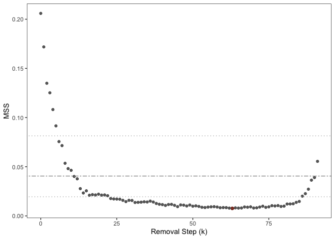

README
================
Michael B. Sohn
01/20/2026

## MIC: <ins>M</ins>ultiple <ins>I</ins>mputation Method for High-Sparse, High-Dimensional, <ins>C</ins>ompositional Data

The *mic* function generates a number of imputed compositional data
using a random selection and amalgamation procedure. For detailed
information about the arguments, please see the documentation for
*mic()*.

### Installation

install.packages(“devtools”)

devtools::install_github(“mbsohn/mic”)

### Example: Generate 20 imputed profiles

``` r
library(mic); library(tidyverse); library(emdbook)
# Simulate datasets for two groups using zero-inflated negative binomial models
set.seed(2026)
n.smpl <- 50; n.taxa <- 100; prop.str.zeros <- 0.5; da.taxa.prop <- 0.2
n.low.abun <- round(n.taxa*0.6)
n.mid.abun <- round(n.taxa*0.3)
n.high.abun <- n.taxa - n.low.abun - n.mid.abun
sim.mean1 <- sim.mean2 <- c(sample(1:3, n.low.abun, rep=TRUE),
                            sample(4:10, n.mid.abun, rep=TRUE),
                            sample(11:100, n.high.abun, rep=TRUE))
sim.wt <- sample(1:20, size=n.smpl, rep=TRUE)
sim.size <- sample(seq(0.5, 2, 0.1), n.taxa, rep=TRUE)
M1 <- rzinbinom(n = n.smpl*n.taxa,
                mu = as.vector(outer(sim.wt, sim.mean1, "*")),
                size = rep(sim.size, each=n.smpl),
                zprob = prop.str.zeros) %>%
  matrix(., nrow=n.smpl, ncol=n.taxa)
da.indx <- sample(1:n.taxa, round(n.taxa*da.taxa.prop))
sim.mean2[da.indx] <- sim.mean1[da.indx]*sample(c(seq(0.1, 0.5, 0.05), seq(2, 10, 0.5)),
                                                round(n.taxa*da.taxa.prop), rep=T)
M2 <- rzinbinom(n = n.smpl*n.taxa,
                mu = as.vector(outer(sim.wt, sim.mean2, "*")),
                size = rep(sim.size, each=n.smpl),
                zprob = prop.str.zeros) %>%
  matrix(., nrow=n.smpl, ncol=n.taxa)
colnames(M1) <- colnames(M2) <- paste0("T", 1:n.taxa)
# Combine M1 and M2 to construct the final profile
M.f <- rbind(M1, M2)
rownames(M.f) <- paste0("S", 1:nrow(M.f))
# Assign group memberships
y <- c(rep(0, n.smpl), rep(1, n.smpl))
# Get differentially abundant taxa
is.true.da.taxa <- (sim.mean1 != sim.mean2)
true.da.taxa <- paste0("T", which(is.true.da.taxa))
# Run mic
rslt <- mic(M=M.f, G=y, nimp=20)
```

### Differential abundance analysis using OPTIMEM

``` r
library(optimem); library(sandwich)
# To identify a reference set for the additive log-ratio transformation
rslt.opt <- optimem(M=M.f, y=y, eta=0.001, early.exit=FALSE)
```

<!-- -->

``` r
##### 
da.rslt.coef <- da.rslt.var <- da.rslt.pval <- 
  matrix(0, nrow=length(rslt$Group1), ncol=ncol(rslt$Group1[[1]]))
colnames(da.rslt.coef) <- colnames(da.rslt.var) <- 
  colnames(da.rslt.pval) <- colnames(rslt$Group1[[1]])
for(i in 1:length(rslt$Group1)){
  M.tmp <- rbind(rslt$Group1[[i]], rslt$Group2[[i]])
  refs.tmp <- rowSums(M.tmp[, rslt.opt$nonDAtaxa_min])
  alrM.tmp <- sweep(M.tmp, 1, refs.tmp, "/") %>% log()
  for(j in 1:ncol(alrM.tmp)){
    lm.tmp <- lm(alrM.tmp[,j] ~ y)
    da.rslt.coef[i,j] <- summary(lm.tmp)$coef[2, "Estimate"]
    da.rslt.var[i,j] <- vcovHC(lm.tmp, type="HC3")[2,2]
    da.rslt.pval[i,j] <- summary(lm.tmp)$coef[2, "Pr(>|t|)"]
  }
}
# Pool the estimates
da.rslt <- pool_mic(t(da.rslt.coef), t(da.rslt.var))
cat("DA taxa: ", true.da.taxa, "\n")
```

    ## DA taxa:  T4 T10 T11 T24 T30 T36 T38 T44 T45 T46 T53 T58 T61 T67 T68 T75 T76 T79 T89 T99

``` r
print(da.rslt)
```

    ##               est        se            W            p         adjp
    ## T1    0.376872638 0.1792577  2.102406836 1.775883e-02 1.000000e+00
    ## T10   1.877597014 0.1660933 11.304471091 6.235164e-30 6.110460e-28
    ## T100  0.210440026 0.1788563  1.176586835 1.196802e-01 1.000000e+00
    ## T11  -1.358849854 0.1882031 -7.220126293 2.596966e-13 2.311299e-11
    ## T12  -0.053404734 0.1838730 -0.290443631 3.857384e-01 1.000000e+00
    ## T13  -0.177839691 0.1788365 -0.994425937 1.600078e-01 1.000000e+00
    ## T14  -0.585217414 0.1813468 -3.227062753 6.253401e-04 4.940187e-02
    ## T15  -0.065000444 0.2018352 -0.322047096 3.737085e-01 1.000000e+00
    ## T16  -0.051145143 0.1970191 -0.259594910 3.975881e-01 1.000000e+00
    ## T17   0.138046526 0.1459715  0.945708460 1.721487e-01 1.000000e+00
    ## T18   0.128627335 0.1365929  0.941683991 1.731772e-01 1.000000e+00
    ## T19  -0.392044920 0.1981888 -1.978138850 2.395652e-02 1.000000e+00
    ## T2    0.539660251 0.1927173  2.800269474 2.552998e-03 1.914749e-01
    ## T20   0.256086793 0.1931845  1.325607331 9.248490e-02 1.000000e+00
    ## T21   0.077685321 0.1511170  0.514074051 3.036001e-01 1.000000e+00
    ## T22   0.317997754 0.2166792  1.467597166 7.110684e-02 1.000000e+00
    ## T23  -0.137533281 0.1915582 -0.717971176 2.363875e-01 1.000000e+00
    ## T24  -1.045879391 0.1857379 -5.630941629 8.961419e-09 7.527592e-07
    ## T25   0.247950192 0.1769337  1.401373591 8.055119e-02 1.000000e+00
    ## T26  -0.210813948 0.1591364 -1.324737348 9.262914e-02 1.000000e+00
    ## T27   0.014873626 0.1960515  0.075865897 4.697629e-01 1.000000e+00
    ## T28   0.502501978 0.1868814  2.688881926 3.584589e-03 2.616750e-01
    ## T29   0.377539855 0.1889486  1.998109006 2.285242e-02 1.000000e+00
    ## T3   -0.268939264 0.1775952 -1.514338641 6.496999e-02 1.000000e+00
    ## T30   2.137107196 0.1857662 11.504286621 6.276147e-31 6.213385e-29
    ## T31  -0.331229143 0.1805946 -1.834102829 3.331937e-02 1.000000e+00
    ## T32   0.032670076 0.1702730  0.191868857 4.239225e-01 1.000000e+00
    ## T33  -0.602419605 0.1702845 -3.537724412 2.017955e-04 1.614364e-02
    ## T34   0.043018369 0.1720926  0.249972163 4.013044e-01 1.000000e+00
    ## T35  -0.034553796 0.1888260 -0.182992779 4.274018e-01 1.000000e+00
    ## T36   0.476724152 0.2566274  1.857650696 3.160932e-02 1.000000e+00
    ## T37   0.373326967 0.2187806  1.706398982 4.396691e-02 1.000000e+00
    ## T38  -0.631672056 0.1183580 -5.336962545 4.725828e-08 3.922437e-06
    ## T39  -0.367566706 0.1711903 -2.147123398 1.589173e-02 1.000000e+00
    ## T4   -1.139168232 0.1848705 -6.161978199 3.592087e-10 3.125116e-08
    ## T40  -0.050560426 0.1470895 -0.343739080 3.655213e-01 1.000000e+00
    ## T41   0.377960555 0.2227569  1.696740361 4.487288e-02 1.000000e+00
    ## T42   0.202308768 0.1523301  1.328094413 9.207346e-02 1.000000e+00
    ## T43   0.090299484 0.1778110  0.507839613 3.057829e-01 1.000000e+00
    ## T44   1.720538289 0.1723419  9.983285266 9.019651e-24 8.568669e-22
    ## T45  -0.472230694 0.1949998 -2.421698777 7.724075e-03 5.484093e-01
    ## T46   1.306993579 0.1804807  7.241734657 2.214909e-13 1.993419e-11
    ## T47   0.452342138 0.2141342  2.112423288 1.732508e-02 1.000000e+00
    ## T48  -0.045835711 0.1843963 -0.248571727 4.018460e-01 1.000000e+00
    ## T49  -0.385439790 0.1552153 -2.483259224 6.509316e-03 4.686707e-01
    ## T5   -0.079567901 0.1689864 -0.470853820 3.188726e-01 1.000000e+00
    ## T50  -0.024146037 0.1565008 -0.154286971 4.386917e-01 1.000000e+00
    ## T51   0.555931105 0.1931895  2.877646982 2.003266e-03 1.522482e-01
    ## T52  -0.032754660 0.1721980 -0.190215109 4.245703e-01 1.000000e+00
    ## T53   2.051175506 0.1879171 10.915319430 4.869317e-28 4.723238e-26
    ## T54   0.329141383 0.1808701  1.819767146 3.439724e-02 1.000000e+00
    ## T55  -0.296157219 0.1922748 -1.540280805 6.174596e-02 1.000000e+00
    ## T56  -0.261703977 0.1594856 -1.640925015 5.040649e-02 1.000000e+00
    ## T57   0.156518020 0.1848393  0.846778882 1.985592e-01 1.000000e+00
    ## T58   1.746663932 0.1776123  9.834136979 4.012636e-23 3.771877e-21
    ## T59   0.197980224 0.1811543  1.092881674 1.372229e-01 1.000000e+00
    ## T6   -0.085518520 0.1809596 -0.472583506 3.182552e-01 1.000000e+00
    ## T60   0.394678048 0.1955887  2.017898369 2.180092e-02 1.000000e+00
    ## T61   1.999883376 0.1580159 12.656214419 5.168236e-37 5.168236e-35
    ## T62   0.280617456 0.1428982  1.963757295 2.477912e-02 1.000000e+00
    ## T63  -0.168289224 0.1722031 -0.977271559 1.642174e-01 1.000000e+00
    ## T64  -0.334085783 0.1690514 -1.976237451 2.406395e-02 1.000000e+00
    ## T65   0.665424284 0.2086434  3.189290320 7.131128e-04 5.562280e-02
    ## T66  -0.046779488 0.2066275 -0.226395236 4.104470e-01 1.000000e+00
    ## T67   1.387219047 0.2111010  6.571353398 2.492998e-11 2.193838e-09
    ## T68   1.032110687 0.1748699  5.902163789 1.793824e-09 1.542688e-07
    ## T69  -0.351598626 0.1629093 -2.158248046 1.545428e-02 1.000000e+00
    ## T7    0.111707607 0.2407856  0.463929827 3.213490e-01 1.000000e+00
    ## T70  -0.154948688 0.2172089 -0.713362402 2.378108e-01 1.000000e+00
    ## T71   0.013086557 0.1514796  0.086391555 4.655776e-01 1.000000e+00
    ## T72   0.196562593 0.2095660  0.937950598 1.741349e-01 1.000000e+00
    ## T73   0.185383692 0.2132028  0.869518107 1.922819e-01 1.000000e+00
    ## T74  -0.046707460 0.2089697 -0.223513025 4.115681e-01 1.000000e+00
    ## T75   1.692146089 0.1745034  9.696922161 1.553654e-22 1.444898e-20
    ## T76   1.542947264 0.1800088  8.571508908 5.106891e-18 4.698340e-16
    ## T77   0.335815541 0.1972263  1.702691288 4.431293e-02 1.000000e+00
    ## T78  -0.225089755 0.2281741 -0.986482682 1.619482e-01 1.000000e+00
    ## T79   2.248771253 0.2625622  8.564718909 5.416991e-18 4.929462e-16
    ## T8    0.632152356 0.1373209  4.603466372 2.077582e-06 1.703617e-04
    ## T80  -0.045799427 0.1691213 -0.270808143 3.932693e-01 1.000000e+00
    ## T81   0.072275340 0.1531254  0.472001061 3.184630e-01 1.000000e+00
    ## T82  -0.037055595 0.1985224 -0.186656958 4.259648e-01 1.000000e+00
    ## T83  -0.534906558 0.1942945 -2.753070437 2.951960e-03 2.184450e-01
    ## T84   0.035323538 0.1641430  0.215199786 4.148058e-01 1.000000e+00
    ## T85   0.276065466 0.1907637  1.447159643 7.392611e-02 1.000000e+00
    ## T86   0.053133901 0.2490890  0.213312899 4.155415e-01 1.000000e+00
    ## T87   0.366282618 0.2150484  1.703256966 4.426000e-02 1.000000e+00
    ## T88   0.001098131 0.1390471  0.007897546 4.968494e-01 1.000000e+00
    ## T89   1.451050325 0.2487253  5.833947741 2.706554e-09 2.300571e-07
    ## T9    0.528154270 0.1683619  3.137017414 8.533799e-04 6.571026e-02
    ## T90  -0.094580191 0.1494053 -0.633044376 2.633523e-01 1.000000e+00
    ## T91   0.792430543 0.1760787  4.500433020 3.390759e-06 2.746514e-04
    ## T92   0.215352949 0.1464085  1.470904302 7.065850e-02 1.000000e+00
    ## T93  -0.444879106 0.2346493 -1.895931855 2.898453e-02 1.000000e+00
    ## T94  -0.202606752 0.1651835 -1.226555685 1.099948e-01 1.000000e+00
    ## T95  -0.130647207 0.1337803 -0.976580529 1.643884e-01 1.000000e+00
    ## T96   0.030060868 0.1573723  0.191017570 4.242559e-01 1.000000e+00
    ## T97  -0.340722506 0.2221287 -1.533896517 6.252756e-02 1.000000e+00
    ## T98  -0.174114596 0.1719020 -1.012871456 1.555608e-01 1.000000e+00
    ## T99   1.863158928 0.1707608 10.910927084 5.110432e-28 4.906015e-26
